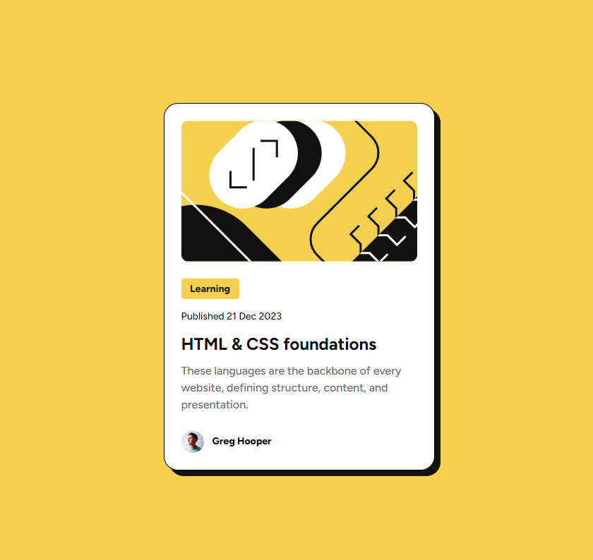

# Frontend Mentor - Blog preview card solution

This is a solution to the [Blog preview card challenge on Frontend Mentor](https://www.frontendmentor.io/challenges/blog-preview-card-ckPaj01IcS). Frontend Mentor challenges help you improve your coding skills by building realistic projects. 

## Table of contents

- [Overview](#overview)
  - [The challenge](#the-challenge)
  - [Screenshot](#screenshot)
  - [Links](#links)
- [My process](#my-process)
  - [Build with](#build-with)
  - [What I learned](#what-i-learned)
- [Author](#author)
- [Acknowledgments](#acknowledgments)

## Overview

### The challenge

Users should be able to:

- See hover and focus states for all interactive elements on the page

### Screenshot

### Links

- Solution URL: [GitHub](https://github.com/cristhianbc7/blog-preview-card-main)
- Live Site URL: [GitHub Pages](https://cristhianbc7.github.io/blog-preview-card-main/)

## My process

### Build with

- Semantic HTML5 markup
- CSS custom properties
- Flexbox
- Mobile-first workflow

### What I learned

During this project, I learned how to create a responsive blog preview card using semantic HTML5 markup and CSS custom properties. I also practiced using Flexbox for layout and implemented a mobile-first workflow. Additionally, I gained experience in creating hover and focus states for interactive elements on the page. Overall, this project helped me improve my coding skills and reinforced my understanding of HTML and CSS concepts. 

## Author

- X - [@cristhianbc_](https://x.com/cristhianbc_)

## Acknowledgments

Thanks, @Islandstone89, for your suggestions.
